# DATASET
[Students Performance Dataset](https://www.kaggle.com/datasets/rabieelkharoua/students-performance-dataset) 

## Información del dataset
Este conjunto de datos consta de 2392 filas y 15 columnas.

## Clase
La clase es la columna `GradeClass`. Esta clase tiene 5 valores posibles: `0 -> A`, `1 -> B`, `2 -> C`, `3 -> D` y `4 -> F`. Es la que clasifica a los estudiantes en función del `GPA`.

# Inciso A
## Distribución de las columnas

### StudentID
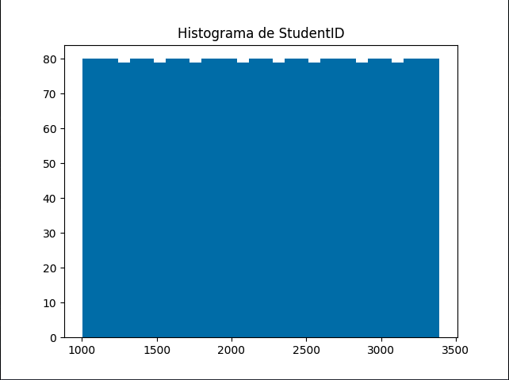

Esta columna es un identificador único para cada estudiante, por lo que no tiene sentido aplicar ninnguna distribución estadística.

### Age
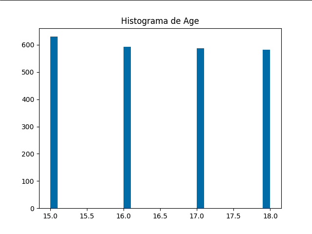

Esta columna representa las edades, usualmente se aplica una distribución normal o gaussiana, ya que suele seguir una tendencia central.

### Gender
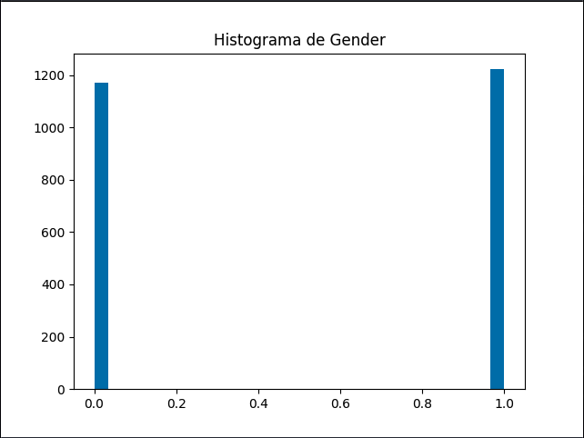

Esta columna es un valor categórico binario, por lo cual se puede deducir que se aplica una distribución Bernoulli.

### Ethnicity
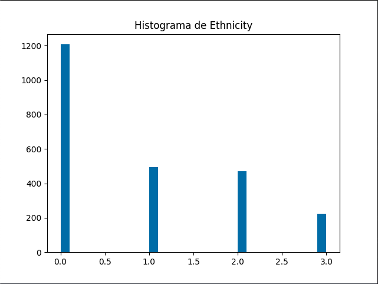

Al ser una columna similar al género se puede decir que podria ser una distribución Bernoulli, pero en este caso al tener mas de dos tipos de valor se puede decir que es una variable categórica.  

### ParentalEducation
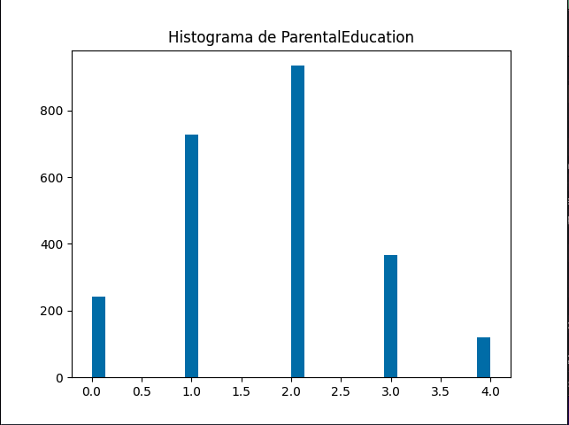

Esta columna tiene valores ordinales (Tipo de educación de los padres), por lo que se puede aplicar una distribución normal.

### StudyTimeWeekly
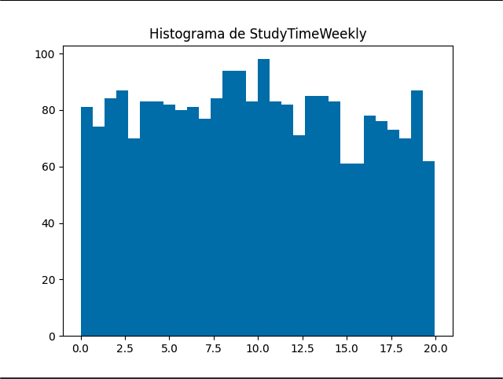

Esta columna tiene una distribución más irregular, pero se puede aproximar a una distribución normal.

### Absences
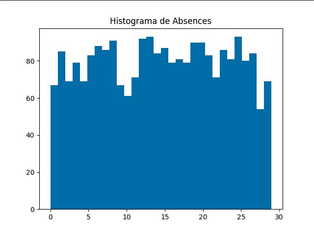

Esta columna es de conteo discreto, por lo que se puede aplicar una distribución de Poisson.

### Tutoring
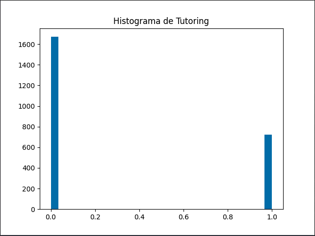

Al ser una columna con valores binarios, se puede aplicar una distribución Bernoulli.

### ParentalSupport
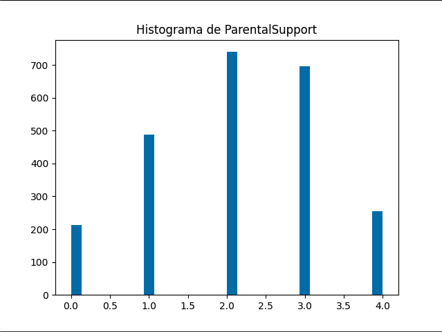

Por la gráfica podemos decucir que se trata de una distribución normal.

### ExtraCurricular, Sports, Music, Volunteering

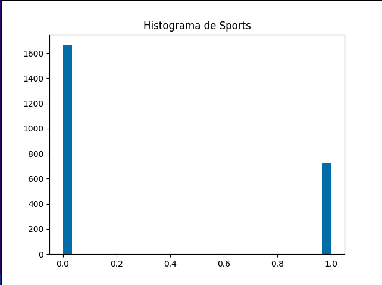
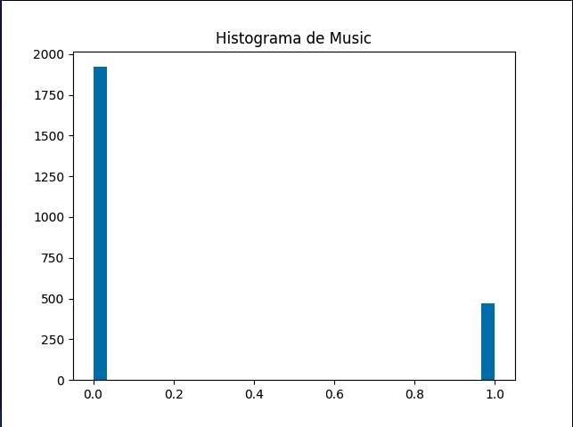
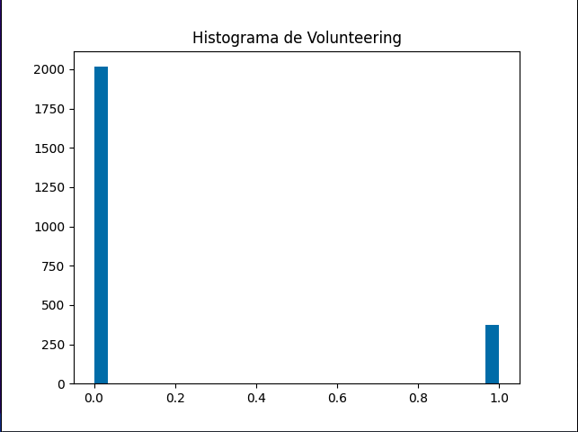

Todas estas columnas son binarias, por lo que se puede aplicar una distribución Bernoulli.

### GPA
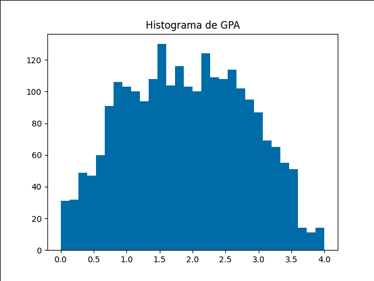

Esta columna es de promedios continuos, por lo que se puede aplicar una distribución normal.

### GradeClass
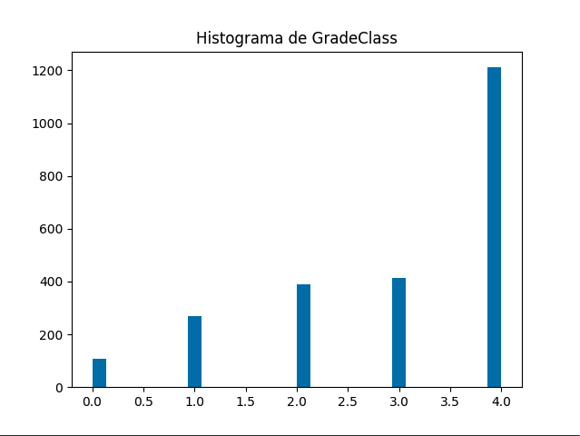

Esta columna es una categórica ordinal, con varias clases, por lo que se puede aplicar una distribución categórica.

# Inciso B

## Columnas seleccionadas

Las columnas seleccionadas son:
- ***Age***
    - La edad puede estar relacionada con la madurez académica.
    - Es posible que influya en la capacidad de gestionar el tiempo de estudio.
    - La edad puede estar asociada en la implicación de actividades extracurriculares.
    - Puede influir en el rendimiento académico.
- ***StudyTimeWeekly*** 
    - Refleja el esfuerzo que el estudiante dedica a sus estudios.
    - Un mayor tiempo de estudio puede estar asociado a un mejor rendimiento académico (GPA).
    - Puede estar influenciado por el apoyo de los padres o tutores.
    - Es una variabe esencial para evaluar el rendimiento académico.
- ***GPA*** 
    - El GPA mide el rendimiento académico del estudiante.
    - Puede estar afectado por el número de ausencias.
    - Puede estar influenciado por el tiempo de estudio semanal.
    - Es una metrica para evaluar el rendimiento académico.

## Gráficas

### Edad vs GPA
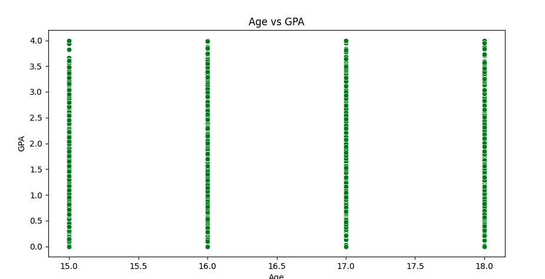

### Tiempo de estudio semanal vs GPA
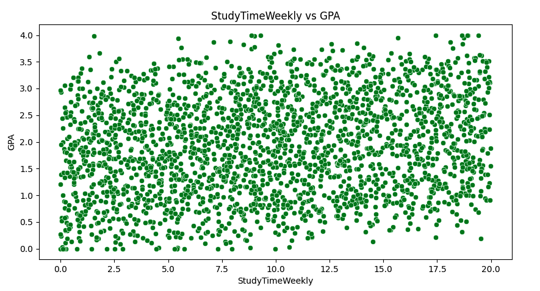

### Mapa de calor
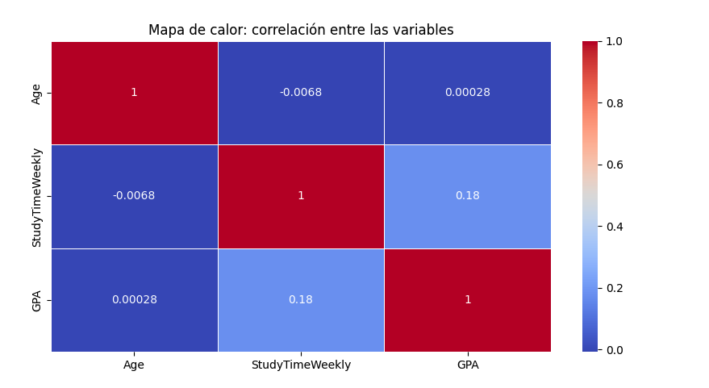

# Inciso C

### Imagen caja y bigotes
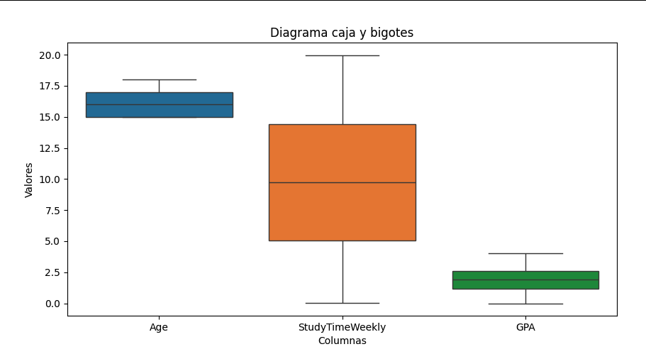

